---
## Front matter
lang: ru-RU
title: Лабораторная работа № 1
author:
  - Сулицкий Богдан Романович
group:
  - НФИбд-02-20, 1032201388
date: 2023, Москва

## i18n babel
babel-lang: russian
babel-otherlangs: english

## Formatting pdf
toc: false
toc-title: Содержание
slide_level: 2
aspectratio: 169
section-titles: true
theme: metropolis
header-includes:
 - \metroset{progressbar=frametitle,sectionpage=progressbar,numbering=fraction}
 - '\makeatletter'
 - '\beamer@ignorenonframefalse'
 - '\makeatother'
---

## Цель  работы

Целью данной работы является приобретение практических навыков установки операционной системы на виртуальную машину, настройки минимально необходимых  для дальнейшей работы сервисов.

## Ход работы

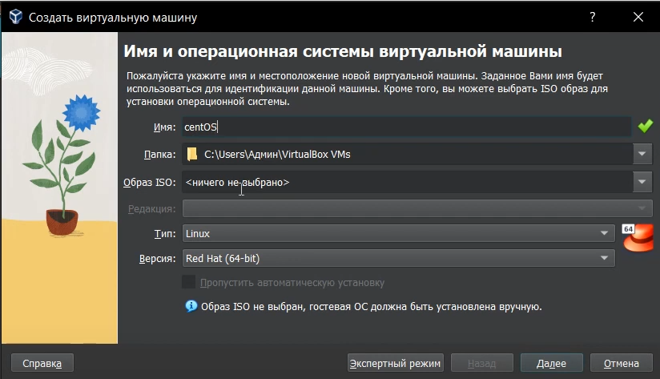{#fig:001 width=55%}

## Ход работы

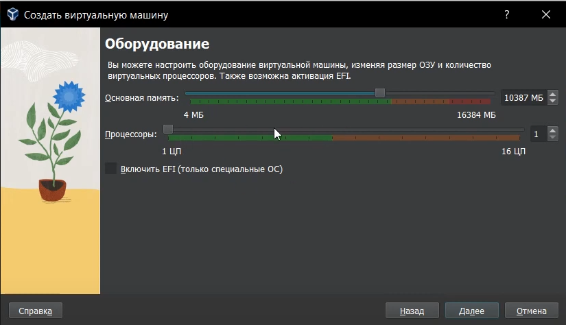{#fig:002 width=35%}

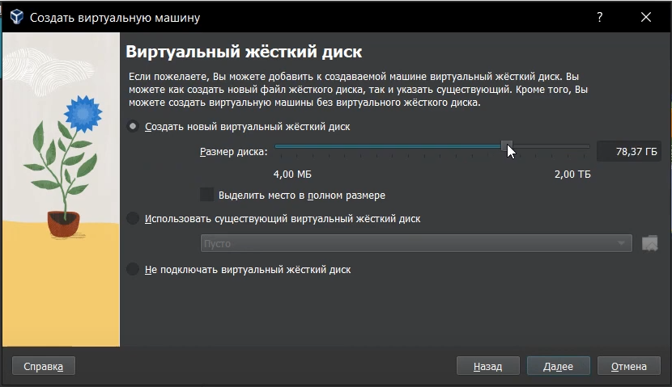{#fig:003 width=30%}

## Ход работы

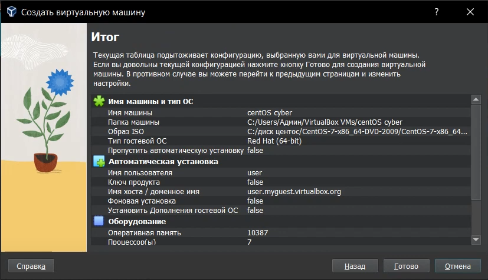{#fig:004 width=55%}

## Ход работы

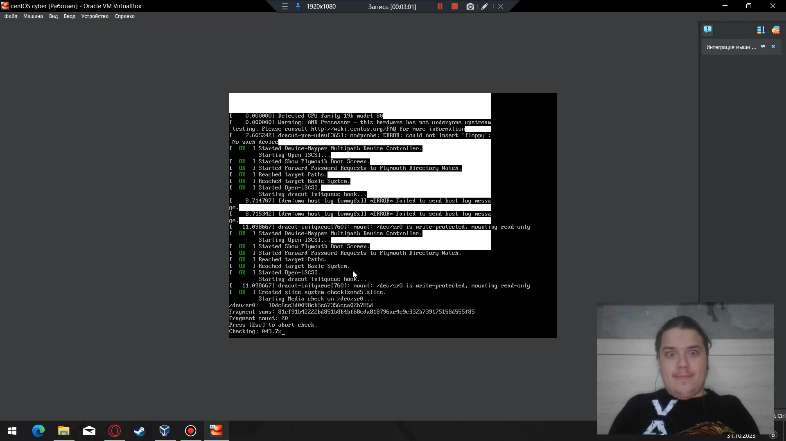{#fig:005 width=65%}

## Ход работы

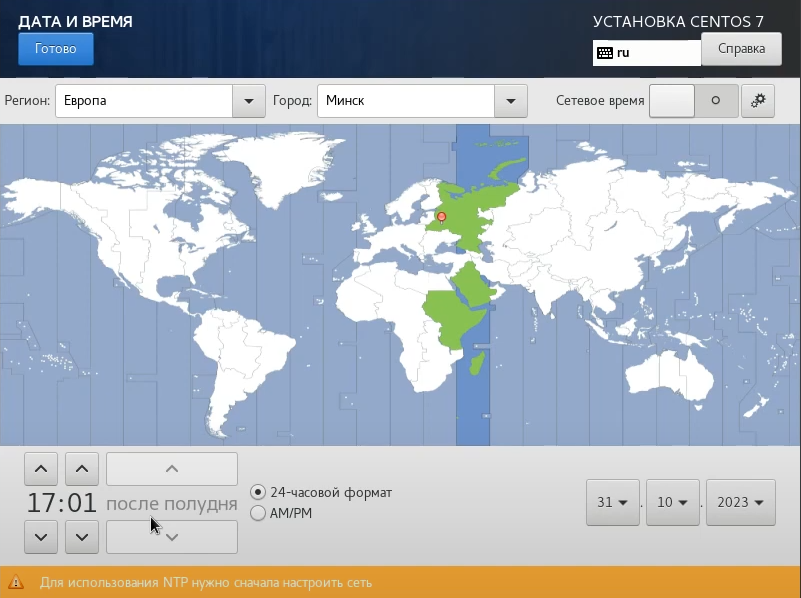{#fig:006 width=55%}

## Ход работы

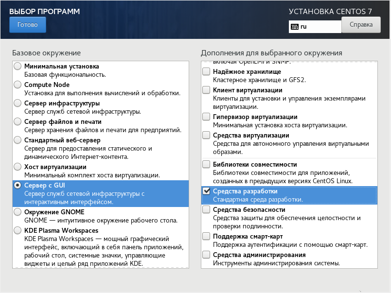{#fig:007 width=55%}

## Ход работы

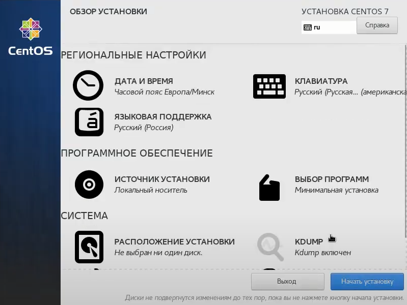{#fig:008 width=55%}

## Ход работы

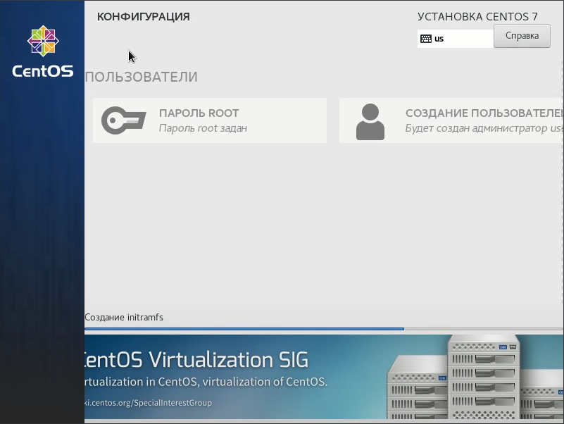{#fig:009 width=55%}

## Ход работы

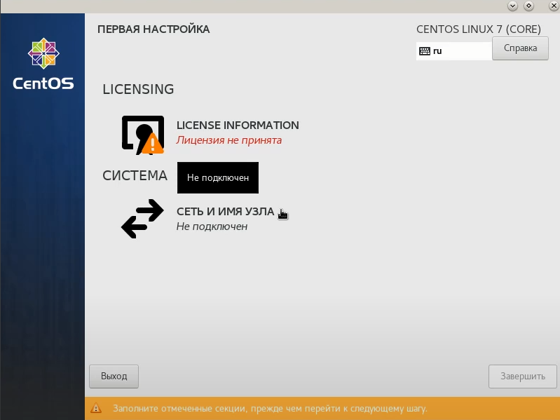{#fig:010 width=55%}

## Ход работы

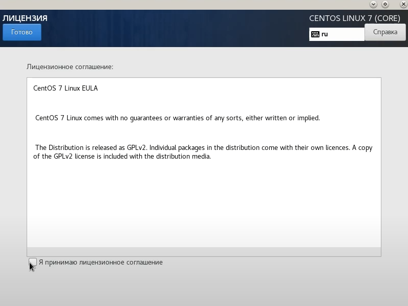{#fig:011 width=55%}

## Ход работы

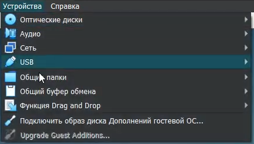{#fig:012 width=55%}

## Ход работы

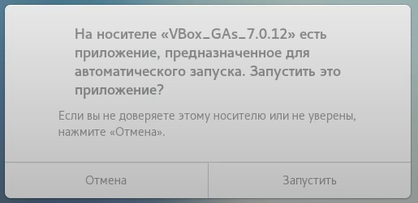{#fig:013 width=55%}

## Ход работы

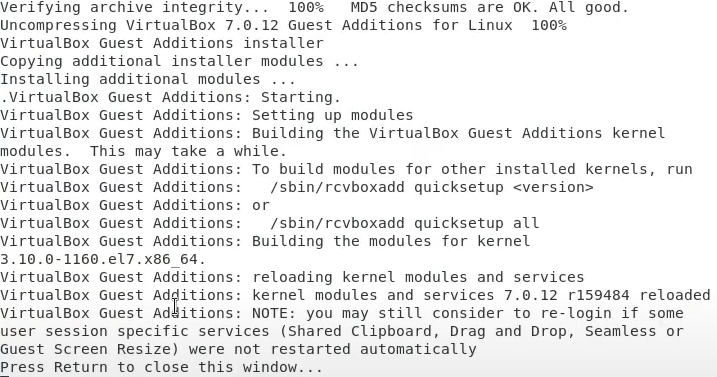{#fig:014 width=55%}

## Ход работы

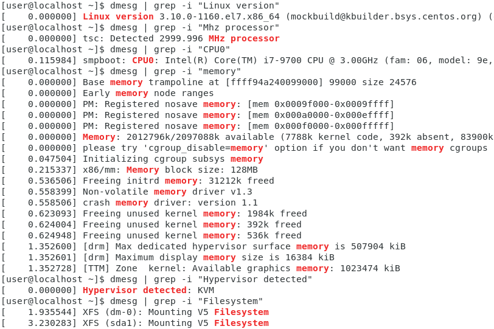{#fig:015 width=55%}

## Выводы:

В результате выполнения работы ознакомился с основными этапами установки виртуальных машин и их настроек, а также создал виртуальную среду для выполнения последующих лабораторных работ.