---
## Front matter
lang: ru-RU
title: Лабораторная работа № 2
author:
  - Сулицкий Богдан Романович
group:
  - НФИбд-02-20, 1032201388
date: 2023, Москва

## i18n babel
babel-lang: russian
babel-otherlangs: english

## Formatting pdf
toc: false
toc-title: Содержание
slide_level: 2
aspectratio: 169
section-titles: true
theme: metropolis
header-includes:
 - \metroset{progressbar=frametitle,sectionpage=progressbar,numbering=fraction}
 - '\makeatletter'
 - '\beamer@ignorenonframefalse'
 - '\makeatother'
---

## Цель работы

Целью данной работы является получение практических навыков работы в консоли с атрибутами файлов, закрепление теоретических основ дискреционного разграничения доступа в современных системах с открытым кодом на базе ОС Linux.

## Ход работы

Создание учетной записи

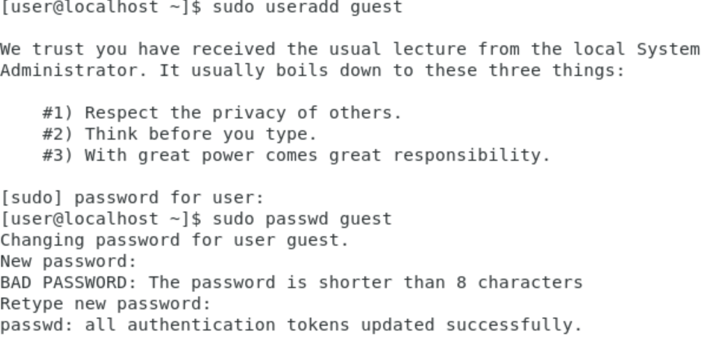{#fig:001 width=45%}

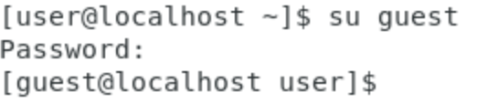{#fig:002 width=25%}

## Ход работы

Проверка состояния системы

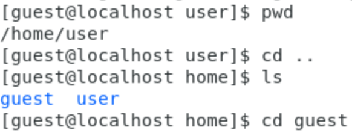{#fig:003 width=45%}

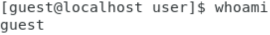{#fig:004 width=35%}

## Ход работы

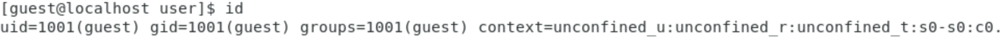{#fig:005 width=85%}

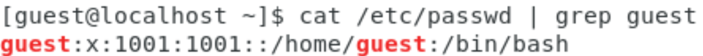{#fig:006 width=55%}

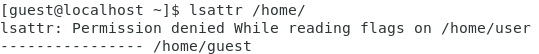{#fig:008 width=60%}

## Ход работы

Операции с поддиректорией

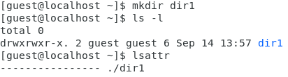{#fig:009 width=45%}

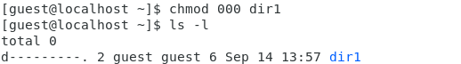{#fig:010 width=45%}

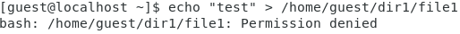{#fig:011 width=45%}

## Ход работы

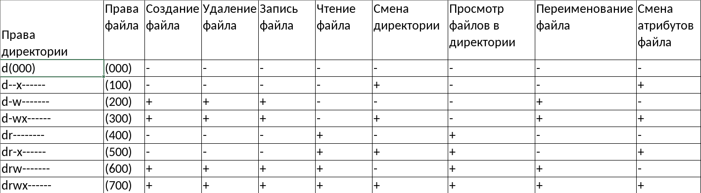{#fig:012 width=60%}

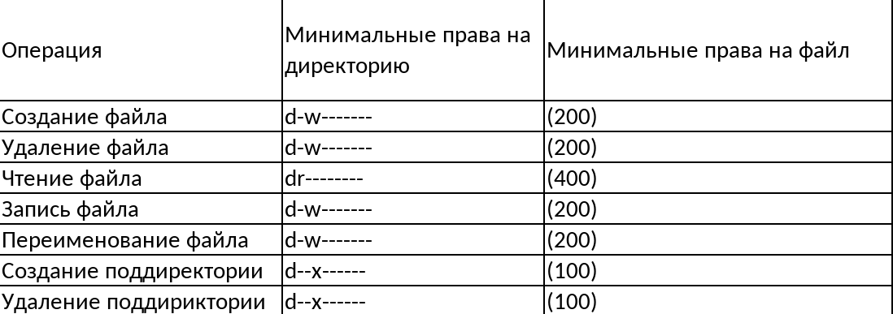{#fig:013 width=60%}

## Результаты

В ходе проделанной работы были получены практические навыки работы в консоли с атрибутами файлов, а также были закреплены теоретические основы дискреционного разграничения доступа в современных системах с открытым кодом на базе ОС Linux.
