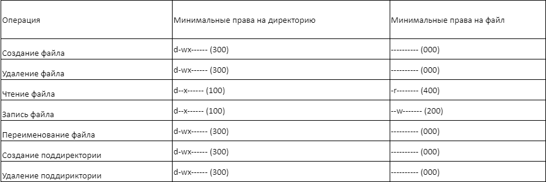

---
## Front matter
title: "Лабораторная работа № 3"
subtitle: "Дисциплина: Информационная безопасность"
author: "Сулицкий Богдан Романович"

## Generic otions
lang: ru-RU
toc-title: "Содержание"

## Bibliography
bibliography: bib/cite.bib
csl: pandoc/csl/gost-r-7-0-5-2008-numeric.csl

## Pdf output format
toc: true # Table of contents
toc-depth: 2
lof: true # List of figures
lot: false
fontsize: 12pt
linestretch: 1.5
papersize: a4
documentclass: scrreprt
## I18n polyglossia
polyglossia-lang:
  name: russian
  options:
	- spelling=modern
	- babelshorthands=true
polyglossia-otherlangs:
  name: english
## I18n babel
babel-lang: russian
babel-otherlangs: english
## Fonts
mainfont: PT Serif
romanfont: PT Serif
sansfont: PT Sans
monofont: PT Mono
mainfontoptions: Ligatures=TeX
romanfontoptions: Ligatures=TeX
sansfontoptions: Ligatures=TeX,Scale=MatchLowercase
monofontoptions: Scale=MatchLowercase,Scale=0.9
## Biblatex
biblatex: true
biblio-style: "gost-numeric"
biblatexoptions:
  - parentracker=true
  - backend=biber
  - hyperref=auto
  - language=auto
  - autolang=other*
  - citestyle=gost-numeric
## Pandoc-crossref LaTeX customization
figureTitle: "Рис."
tableTitle: "Таблица"
listingTitle: "Листинг"
lofTitle: "Список иллюстраций"
lotTitle: "Список таблиц"
lolTitle: "Листинги"
## Misc options
indent: true
header-includes:
  - \usepackage{indentfirst}
  - \usepackage{float} # keep figures where there are in the text
  - \floatplacement{figure}{H} # keep figures where there are in the text
---

# Цель работы

Целью данной работы является получение практических навыков работы в консоли с атрибутами файлов для групп пользователей.

# Задание

1. Создать учетные записи guest и guest2.

2. Выполнить ряд операций в новосозданных учетных записях.

3. Заполнить таблицу "Установленные права и разрешенные действия".

4. Заполнить таблицу "Минимальные права для совершения операций".

# Выполнение лабораторной работы

1. Я создал учетные записи guest guest2 и задал пароль(@fig:001).

{#fig:001}

2. Я добавил пользователя guest2 в группу guest(@fig:002).

{#fig:002}

3. Я осуществил вход в систему от двух пользователей на двух разных консолях(@fig:003).

{#fig:003}

4. Я определил директорию для обоих пользователей командой pwd, в которой мы нахожусь. Далее перешёл в домашние директории каждого пользователя(@fig:004-@fig:005).

{#fig:004}

{#fig:005}

5. Я уточнил имя пользователя, его группу, кто входит в неё и к каким группам принадлежит он сам(@fig:006 - @fig:007).

{#fig:006}

{#fig:007}

6. Я сравнил полученную информацию с содержимым файла /etc/group(@fig:008).

{#fig:008}

Вывелась информация о группе, id и название подгруппы.

7. Я выполнил  регистрацию пользователя guest2 в группе guest от имени пользователя guest2(@fig:009).

{#fig:009}

8. Я изменил права директории /home/guest от имени пользователя guest, разрешив все действия для пользователей группы(@fig:010).

{#fig:010}

9. Я создал поддирекорию /home/guest/dir1 и снял с неё все атрибуты от имени пользователя guest(@fig:011).

{#fig:011}

10. Я заполнил таблицу установленных прав и разрешённых действий(@fig:012).

{#fig:012}

11. Я заполнил таблицу минимальных права для совершения операций(@fig:013).

{#fig:013}

# Выводы

В ходе проделанной работы были получены практические навыки работы в консоли с атрибутами файлов для групп пользователей.

# Список литературы{.unnumbered}

[1] https://esystem.rudn.ru/pluginfile.php/2090275/mod_resource/content/4/003-lab_discret_2users.pdf