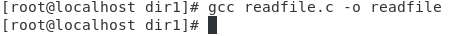

---
## Front matter
title: "Лабораторная работа № 5"
subtitle: "Дисциплина: Информационная безопасность"
author: "Сулицкий Богдан Романович"

## Generic otions
lang: ru-RU
toc-title: "Содержание"

## Bibliography
bibliography: bib/cite.bib
csl: pandoc/csl/gost-r-7-0-5-2008-numeric.csl

## Pdf output format
toc: true # Table of contents
toc-depth: 2
lof: true # List of figures
lot: false
fontsize: 12pt
linestretch: 1.5
papersize: a4
documentclass: scrreprt
## I18n polyglossia
polyglossia-lang:
  name: russian
  options:
	- spelling=modern
	- babelshorthands=true
polyglossia-otherlangs:
  name: english
## I18n babel
babel-lang: russian
babel-otherlangs: english
## Fonts
mainfont: PT Serif
romanfont: PT Serif
sansfont: PT Sans
monofont: PT Mono
mainfontoptions: Ligatures=TeX
romanfontoptions: Ligatures=TeX
sansfontoptions: Ligatures=TeX,Scale=MatchLowercase
monofontoptions: Scale=MatchLowercase,Scale=0.9
## Biblatex
biblatex: true
biblio-style: "gost-numeric"
biblatexoptions:
  - parentracker=true
  - backend=biber
  - hyperref=auto
  - language=auto
  - autolang=other*
  - citestyle=gost-numeric
## Pandoc-crossref LaTeX customization
figureTitle: "Рис."
tableTitle: "Таблица"
listingTitle: "Листинг"
lofTitle: "Список иллюстраций"
lotTitle: "Список таблиц"
lolTitle: "Листинги"
## Misc options
indent: true
header-includes:
  - \usepackage{indentfirst}
  - \usepackage{float} # keep figures where there are in the text
  - \floatplacement{figure}{H} # keep figures where there are in the text
---

# Цель работы

Целью данной лабораторной работы является изучение механизмов изменения идентификаторов, применения SetUID- и Sticky-битов. Получение практических навыков работы в консоли с дополнительными атрибутами. Рассмотрение работы механизма смены идентификатора процессов пользователей, а также влияние бита Sticky на запись и удаление файлов.

# Выполнение лабораторной работы

## Создание программы

1. Я вошёл в систему от имени пользователя guest(@fig:001).

{#fig:001}

И создал программу simpleid.c(@fig:002).

{#fig:002}

2. Я скомпилировал и выполнил программу simpleid. Далее я выполнил системную программу id(@fig:003).

{#fig:003}

Данные, выведенные simpleid и id совпадают.

3. Я скопировал файл simpleid.c для последующего редактирования(@fig:004).
{#fig:004}

И усложнил программу, добавив вывод действительных идентификаторов(@fig:005).

{#fig:005}

4. Я скомпилировал и запустил simpleid2.c(@fig:006).

{#fig:006}

5. От имени суперпользователя я выполнил команды:
```
chown root:guest /home/guest/simpleid2
chmod u+s /home/guest/simpleid2
```
Далее я выполнил проверку правильности установки новых атрибутов и смены владельца файла simpleid2, после чего запустил simpleid2 и id. И проделал то же самое относительно SetGID-бита(@fig:007).

{#fig:007}

6. Я создал программу readfile.c(@fig:008).

{#fig:008}

{#fig:009}

И успешно скомпилировал её (@fig:010).

{#fig:010}

7. Я сменил владельца у файла readfile.c и изменил права так, чтобы только суперпользователь (root) мог прочитать его, a guest не мог, после чего проверил, что пользователь guest не может прочитать файл readfile.c(@fig:011).

{#fig:011}

8. Я сменил у программы readfile владельца и установил SetU’D-бит, после чего проверил, может ли программа readfile прочитать файлы readfile.c и /etc/shadow(@fig:012).

{#fig:012 width=80%}

## Исследование Sticky-бита

1. Я выяснил, установлен ли атрибут Sticky на директории /tmp(@fig:013).

{#fig:013}

2. От имени пользователя guest я создал файл file01.txt в директории /tmp со словом test, далее просмотрел атрибуты у только что созданного файла и разрешил чтение и запись для категории пользователей «все остальные»(@fig:014).

{#fig:014}

3. От пользователя guest2 я прочитал файл /tmp/file01.txt и дозаписал в файл слово test. Далее я записал в файл /tmp/file01.txt слово test3, стерев при этом всю имеющуюся в файле информацию и проверил содержимое файла командой. Я попробовал удалить файл file01.txt(@fig:015).

{#fig:015}

Однако в ответ я получил отказ от выполнения операции.

4. Я повысил свои права до суперпользователя, затем снял атрибут t с директории /tmp, после чего покинул режим суперпользователя командой exit(@fig:016).

{#fig:016}

5. Я от имени пользователя guest2 проверил, что атрибута t у директории /tmp
нет, после чего повторил те же действия. Теперь я могу удалить файл file01.txt(@fig:017).

{#fig:017}

6. Я повысил свои права до суперпользователя и вернул атрибут t на директорию /tmp(@fig:018).

{#fig:018}

# Вывод

В ходе проделанной работы я изучил механизмы изменения идентификаторов, применения SetUID- и Sticky-битов, получил практических навыков работы в консоли с дополнительными атрибутами, а также рассмотрел работы механизма смены идентификатора процессов пользователей, а также влияние бита Sticky на запись и удаление файлов.

# Список литературы{.unnumbered}

[1] (https://esystem.rudn.ru/pluginfile.php/2090279/mod_resource/content/2/005-lab_discret_sticky.pdf)