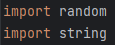
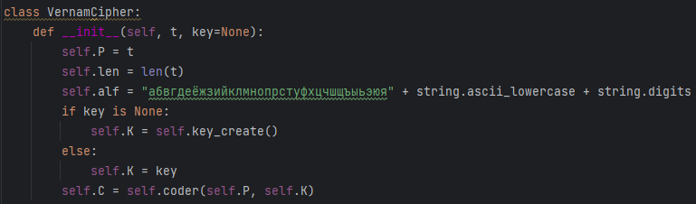
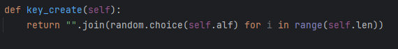
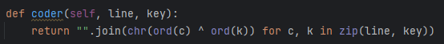
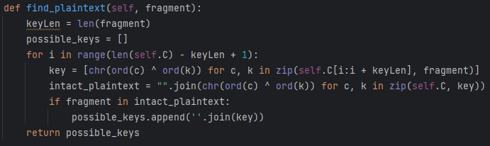
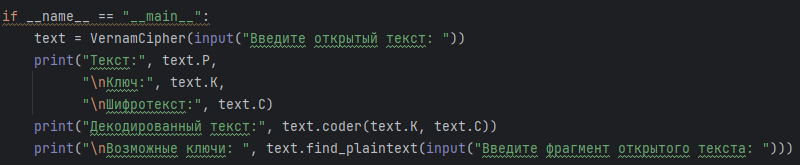
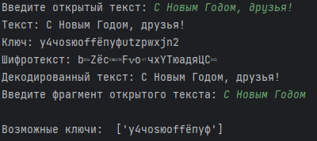

---
## Front matter
lang: ru-RU
title: Лабораторная работа № 7
author:
  - Сулицкий Богдан Романовичч
group:
  - НФИбд-02-20, 1032201388
date: 2023, Москва

## i18n babel
babel-lang: russian
babel-otherlangs: english

## Formatting pdf
toc: false
toc-title: Содержание
slide_level: 2
aspectratio: 169
section-titles: true
theme: metropolis
header-includes:
 - \metroset{progressbar=frametitle,sectionpage=progressbar,numbering=fraction}
 - '\makeatletter'
 - '\beamer@ignorenonframefalse'
 - '\makeatother'
---

## Цель работы

Целью данной лабораторной работы является освоение на практике применения режима однократного гаммирования.

## Ход работы

{#fig:001}

## Ход работы

{#fig:002}

## Ход работы

{#fig:003}

## Ход работы

{#fig:004}

## Ход работы

{#fig:005}

## Ход работы

{#fig:006}

## Ход работы

{#fig:007}

## Вывод

В ходе проделанной лабораторной работы я освоил на практике применение режима однократного гаммирования.