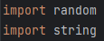
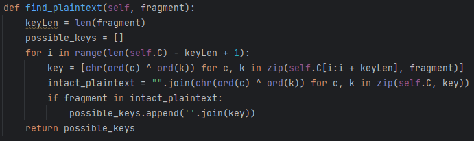
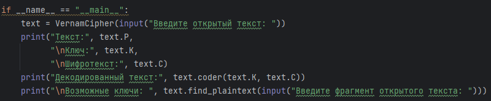
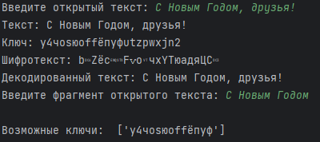

---
## Front matter
title: "Лабораторная работа № 7"
subtitle: "Дисциплина: Информационная безопасность"
author: "Сулицкий Богдан Романович"

## Generic otions
lang: ru-RU
toc-title: "Содержание"

## Bibliography
bibliography: bib/cite.bib
csl: pandoc/csl/gost-r-7-0-5-2008-numeric.csl

## Pdf output format
toc: true # Table of contents
toc-depth: 2
lof: true # List of figures
lot: false
fontsize: 12pt
linestretch: 1.5
papersize: a4
documentclass: scrreprt
## I18n polyglossia
polyglossia-lang:
  name: russian
  options:
	- spelling=modern
	- babelshorthands=true
polyglossia-otherlangs:
  name: english
## I18n babel
babel-lang: russian
babel-otherlangs: english
## Fonts
mainfont: PT Serif
romanfont: PT Serif
sansfont: PT Sans
monofont: PT Mono
mainfontoptions: Ligatures=TeX
romanfontoptions: Ligatures=TeX
sansfontoptions: Ligatures=TeX,Scale=MatchLowercase
monofontoptions: Scale=MatchLowercase,Scale=0.9
## Biblatex
biblatex: true
biblio-style: "gost-numeric"
biblatexoptions:
  - parentracker=true
  - backend=biber
  - hyperref=auto
  - language=auto
  - autolang=other*
  - citestyle=gost-numeric
## Pandoc-crossref LaTeX customization
figureTitle: "Рис."
tableTitle: "Таблица"
listingTitle: "Листинг"
lofTitle: "Список иллюстраций"
lotTitle: "Список таблиц"
lolTitle: "Листинги"
## Misc options
indent: true
header-includes:
  - \usepackage{indentfirst}
  - \usepackage{float} # keep figures where there are in the text
  - \floatplacement{figure}{H} # keep figures where there are in the text
---

# Цель работы

Целью данной лабораторной работы является освоение на практике применения режима однократного гаммирования.

# Выполнение лабораторной работы

1. Я добавил нужные библиотеки для дальнейших действий(@fig:001).

{#fig:001}

2. Я создал класс VernamCipher, принимающий в конструкторе текст как переменную(@fig:002).

{#fig:002}

3. Я создал метод, генерирующий ключ шифрования(@fig:003).

{#fig:003}

4. Я создал метод, который не только шифрует, но и дешифрует текст(@fig:004).

{#fig:004}

5. Я создал метод, определяющий ключ, с помощью которого шифротекст может быть преобразован в некоторый фрагмент текста, представляющий собой один из
возможных вариантов прочтения открытого текста(@fig:005).

{#fig:005}

6. Я создал инициализацию класса с вводом текста и вызов всех методов класса с последующим выводом данных (@fig:006).

{#fig:006}

7. Результат (@fig:007)

{#fig:007}

# Вывод

В ходе проделанной лабораторной работы я освоил на практике применение режима однократного гаммирования.

# Список литературы{.unnumbered}

[1] https://esystem.rudn.ru/pluginfile.php/2090284/mod_resource/content/2/007-lab_crypto-gamma.pdf